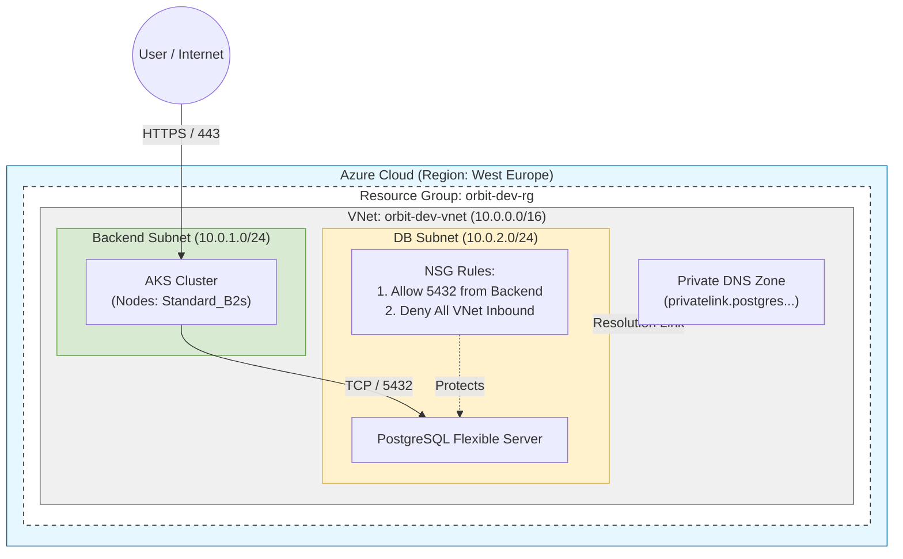

# Orbit - Modular Azure Infrastructure with Terraform

This repository contains Terraform code to deploy a modular Azure infrastructure, consisting of a network, an AKS cluster, and a PostgreSQL database. The infrastructure is managed in two parts: a `bootstrap` part for the Terraform state backend, and a `main_infrastructure` part for the core services.

## Folder Structure

```
.
├── .github/workflows/      # GitHub Actions CI/CD pipeline
│   └── terraform.yml
├── bootstrap/              # Terraform code for the remote state backend
│   ├── main.tf
│   ├── outputs.tf
│   └── variables.tf
├── main_infrastructure/    # Main Terraform project
│   ├── env/dev/            # 'dev' environment configuration
│   │   ├── main.tf
│   │   └── variables.tf
│   └── modules/            # Reusable Terraform modules
│       ├── aks/
│       ├── database/
│       └── network/
└── README.md
```

## Prerequisites

*   [Azure CLI](https://docs.microsoft.com/en-us/cli/azure/install-azure-cli)
*   [Terraform](https://learn.hashicorp.com/tutorials/terraform/install-cli)
*   [Git](https://git-scm.com/downloads)
*   A GitHub account
*   An Azure subscription

## Deployment Steps

### 1. Clone the Repository

```bash
git clone <repository-url>
cd <repository-name>
```

### 2. Authenticate to Azure

Login to your Azure account using the Azure CLI:

```bash
az login
az account set --subscription "<your-subscription-id>"
```

### 3. Deploy the Bootstrap Infrastructure

The bootstrap infrastructure creates a resource group, a storage account, and a storage container to store the Terraform state for the main infrastructure remotely. This is a one-time setup.

```bash
# Navigate to the bootstrap directory
cd bootstrap

# Initialize Terraform
terraform init

# Apply the Terraform configuration
terraform apply
```

After the apply is complete, Terraform will output the names of the created resources. You will need these for the GitHub secrets configuration.

### 4. Configure GitHub Secrets

First, create a Service Principal for Terraform to authenticate with Azure. Run this command (replace `<subscription-id>` with your actual Subscription ID):

```bash
az ad sp create-for-rbac --name "orbit-cicd" --role Contributor --scopes /subscriptions/<subscription-id>
```

The command will output a JSON object containing the credentials.

Next, go to your GitHub repository, navigate to `Settings` > `Secrets and variables` > `Actions`, and create the following secrets:

**Azure Service Principal Credentials:**

*   `ARM_CLIENT_ID`: The `appId` value from the JSON output.
*   `ARM_CLIENT_SECRET`: The `password` value from the JSON output.
*   `ARM_SUBSCRIPTION_ID`: Your Azure Subscription ID.
*   `ARM_TENANT_ID`: The `tenant` value from the JSON output.

**Terraform State Backend Details (from bootstrap output):**

*   `TFSTATE_RG`: The name of the resource group created by the bootstrap process.
*   `TFSTATE_SA`: The name of the storage account created by the bootstrap process.
*   `TFSTATE_CONTAINER`: The name of the container created by the bootstrap process.

**Database Credentials:**

*   `DB_ADMIN_LOGIN`: The desired administrator username for the PostgreSQL database.
*   `DB_ADMIN_PASSWORD`: The desired administrator password for the PostgreSQL database.

### 5. CI/CD Pipeline

The GitHub Actions pipeline is defined in `.github/workflows/terraform.yml` and automates the deployment of the `main_infrastructure`.

**Trigger:**

*   The pipeline runs on every `push` or `pull_request` to the `main` branch.
*   It can also be triggered manually (`workflow_dispatch`) to destroy the infrastructure.

**Workflow:**

1.  **Checkout:** The repository code is checked out.
2.  **Setup Terraform:** The specified version of Terraform is installed.
3.  **Terraform Init:** The working directory is initialized. It configures the `azurerm` backend using the `TFSTATE_*` secrets.
4.  **Terraform Validate:** Checks if the configuration is syntactically valid.
5.  **Terraform Plan:** Generates an execution plan showing pending changes.
6.  **Terraform Apply (on Push to `main`):** If the workflow was triggered by a push to the `main` branch, the changes are automatically applied to the Azure environment.
7.  **Terraform Destroy (Manual Trigger):** If triggered manually with the `destroy_only` option set to `true`, the infrastructure is destroyed.

Once you have configured the secrets and push a commit to the `main` branch, the pipeline will run and deploy your infrastructure.

### 6. Azure Cloud Infrastructure diagram


