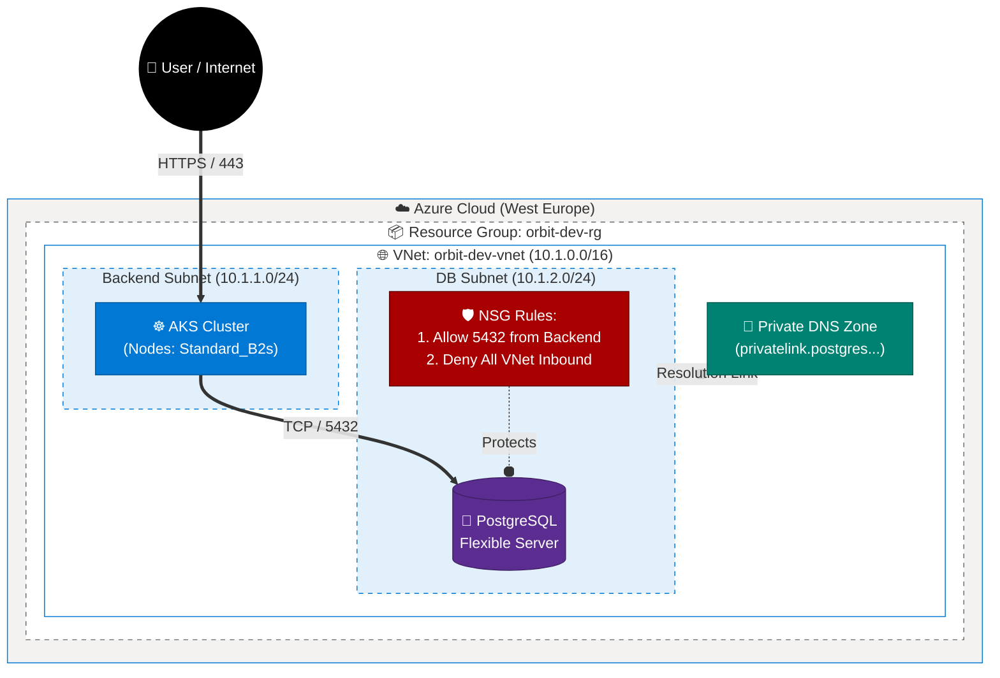
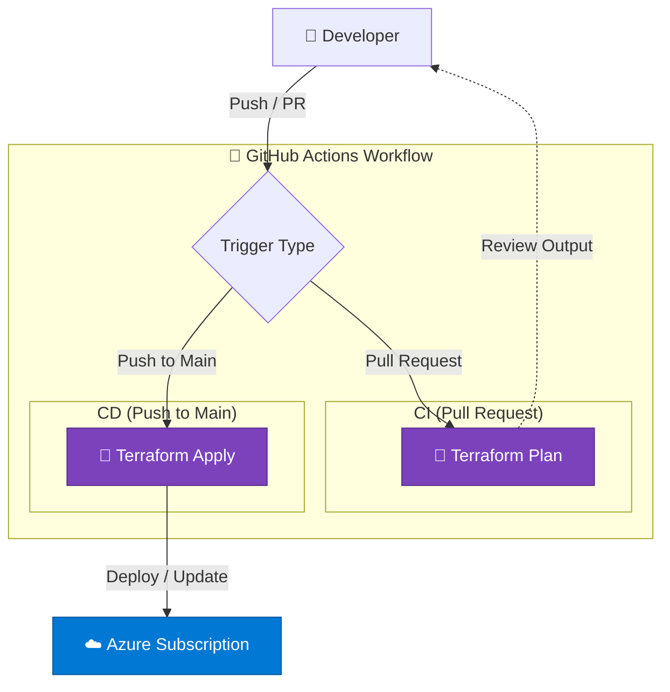

# Dokumentace Projektu Orbit

## 1. Infrastructure Architecture
Tento diagram zobrazuje topologii sítě v Azure.

```mermaid
flowchart TB
    %% Define Styles
    classDef user fill:#000,stroke:#000,color:#fff
    classDef azure fill:#0078D4,stroke:#005A9E,color:#fff
    classDef db fill:#5C2D91,stroke:#3E1F63,color:#fff
    classDef nsg fill:#A80000,stroke:#5C0000,color:#fff
    classDef dns fill:#008272,stroke:#005C51,color:#fff
    classDef subnet fill:#E1F0FA,stroke:#0078D4,stroke-dasharray: 5 5

    UserNode((👤 User / Internet)):::user
    
    subgraph AzureCloud["☁️ Azure Cloud (West Europe)"]
        style AzureCloud fill:#F3F2F1,stroke:#0078D4
        
        subgraph RG["📦 Resource Group: orbit-dev-rg"]
            style RG fill:#FFF,stroke:#666,stroke-dasharray: 5 5

            subgraph VNet["🌐 VNet: orbit-dev-vnet (10.1.0.0/16)"]
                style VNet fill:#FFF,stroke:#0078D4

                subgraph BackendSubnet["Backend Subnet (10.1.1.0/24)"]
                    style BackendSubnet fill:#E1F0FA,stroke:#0078D4,stroke-dasharray: 5 5
                    AKS["☸️ AKS Cluster<br/>(Nodes: Standard_B2s)"]:::azure
                end

                subgraph DBSubnet["DB Subnet (10.1.2.0/24)"]
                    style DBSubnet fill:#E1F0FA,stroke:#0078D4,stroke-dasharray: 5 5
                    Postgres[("🐘 PostgreSQL<br/>Flexible Server")]:::db
                    NSG["🛡️ NSG Rules:<br/>1. Allow 5432 from Backend<br/>2. Deny All VNet Inbound"]:::nsg
                end
                
                DNS["📖 Private DNS Zone<br/>(privatelink.postgres...)"]:::dns
            end
        end
    end

    UserNode ==>|HTTPS / 443| AKS
    AKS ==>|TCP / 5432| Postgres
    NSG -.-o|Protects| Postgres
    DNS -.-o|Resolution Link| VNet
```

```mermaid
flowchart TD
    %% Styles
    classDef action fill:#2088FF,stroke:#005CC5,color:#fff
    classDef tf fill:#7B42BC,stroke:#5A308C,color:#fff
    classDef azure fill:#0078D4,stroke:#005A9E,color:#fff

    Dev[👤 Developer]

    subgraph GitHub ["🐙 GitHub Actions Workflow"]
        direction TB
        Trigger{Trigger Type}

        subgraph CI["CI (Pull Request)"]
            Plan[📄 Terraform Plan]:::tf
        end

        subgraph CD["CD (Push to Main)"]
            Apply[🚀 Terraform Apply]:::tf
        end
    end

    AzSub[☁️ Azure Subscription]:::azure

    Dev -->|Push / PR| Trigger
    Trigger -->|Pull Request| Plan
    Trigger -->|Push to Main| Apply
    Plan -.->|Review Output| Dev
    Apply -->|Deploy / Update| AzSub
```