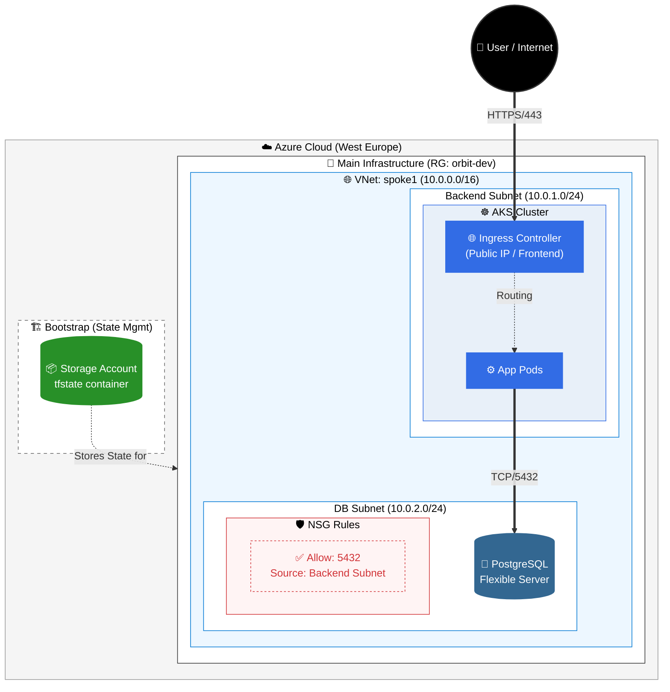
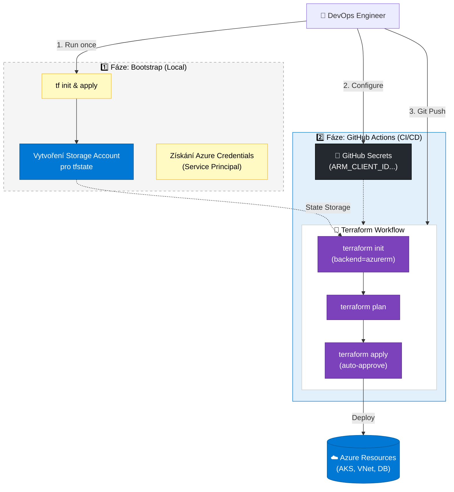

## 1. Infrastructure Architecture

This diagram illustrates the Azure network topology, including the Bootstrap layer for state management and the Main Infrastructure.

```mermaid
flowchart TD
    %% --- DEFINICE STYLŮ ---
    %% Tmavé nody (zdroje) -> Bílý text
    classDef user fill:#000000,stroke:#333,stroke-width:2px,color:#fff
    classDef k8s fill:#326CE5,stroke:#326CE5,stroke-width:2px,color:#fff
    classDef db fill:#336791,stroke:#336791,stroke-width:2px,color:#fff
    classDef storage fill:#289028,stroke:#289028,stroke-width:2px,color:#fff
    
    %% Světlé nody (pravidla, poznámky) -> Černý text
    classDef security fill:#FFF4F4,stroke:#D13438,stroke-width:1px,color:#D13438,stroke-dasharray: 3 3

    %% --- UŽIVATEL ---
    User((👤 User / Internet)):::user

    %% --- AZURE CLOUD ---
    subgraph Azure["☁️ Azure Cloud (West Europe)"]
        style Azure fill:#F5F5F5,stroke:#999,stroke-width:1px,color:#000000

        %% --- BOOTSTRAP VRSTVA ---
        subgraph Bootstrap["🏗️ Bootstrap (State Mgmt)"]
            style Bootstrap fill:#ffffff,stroke:#666,stroke-dasharray: 5 5,color:#000000
            TFState[("📦 Storage Account<br/>tfstate container")]:::storage
        end

        %% --- HLAVNÍ INFRASTRUKTURA ---
        subgraph MainInfra["🚀 Main Infrastructure (RG: orbit-dev)"]
            style MainInfra fill:#ffffff,stroke:#333,color:#000000

            %% --- VNET ---
            subgraph VNet["🌐 VNet: spoke1 (10.0.0.0/16)"]
                style VNet fill:#EDF7FF,stroke:#0078D4,color:#000000

                %% --- BACKEND SUBNET ---
                subgraph SubnetAKS["Backend Subnet (10.0.1.0/24)"]
                    style SubnetAKS fill:#ffffff,stroke:#0078D4,color:#000000
                    
                    subgraph AKS["☸️ AKS Cluster"]
                        style AKS fill:#E8F0F9,stroke:#326CE5,color:#000000
                        Ingress["🌐 Ingress Controller<br/>(Public IP / Frontend)"]:::k8s
                        AppPod["⚙️ App Pods"]:::k8s
                    end
                end

                %% --- DB SUBNET ---
                subgraph SubnetDB["DB Subnet (10.0.2.0/24)"]
                    style SubnetDB fill:#ffffff,stroke:#0078D4,color:#000000
                    
                    Postgres[("🐘 PostgreSQL<br/>Flexible Server")]:::db
                    
                    subgraph NSG["🛡️ NSG Rules"]
                        style NSG fill:#FFF4F4,stroke:#D13438,color:#000000
                        Rule1["✅ Allow: 5432<br/>Source: Backend Subnet"]:::security
                    end
                end
            end
        end
    end

    %% --- PROPOJENÍ ---
    User == HTTPS/443 ==> Ingress
    Ingress -.->|Routing| AppPod
    AppPod == TCP/5432 ==> Postgres
    
    %% Vazba NSG a State
    NSG -.-o SubnetDB
    TFState -.->|Stores State for| MainInfra
```

```mermaid
flowchart TD
    %% --- STYLOVÁNÍ ---
    %% Manuální kroky - Žlutá, černý text
    classDef manual fill:#FFF9C4,stroke:#FBC02D,color:#000000
    %% GitHub kroky - Tmavá, bílý text
    classDef gh fill:#24292F,stroke:#000,color:#fff
    %% Terraform akce - Fialová, bílý text
    classDef terraform fill:#7B42BC,stroke:#5A308C,color:#fff
    %% Azure zdroje - Modrá, bílý text
    classDef azure fill:#0078D4,stroke:#005A9E,color:#fff

    %% --- AKTÉŘI ---
    Dev[👤 DevOps Engineer]

    %% --- 1. FÁZE: BOOTSTRAP ---
    subgraph Phase1["1️⃣ Fáze: Bootstrap (Local)"]
        style Phase1 fill:#F5F5F5,stroke:#999,stroke-dasharray: 5 5,color:#000000
        InitLocal["tf init & apply"]:::manual
        CreateSA["Vytvoření Storage Account<br/>pro tfstate"]:::azure
        GetCreds["Získání Azure Credentials<br/>(Service Principal)"]:::manual
    end

    %% --- 2. FÁZE: GITHUB ACTIONS ---
    subgraph Phase2["2️⃣ Fáze: GitHub Actions (CI/CD)"]
        style Phase2 fill:#E1F0FA,stroke:#0078D4,color:#000000
        
        Secrets["🔐 GitHub Secrets<br/>(ARM_CLIENT_ID...)"]:::gh
        
        subgraph Pipeline["🔄 Terraform Workflow"]
            style Pipeline fill:#ffffff,stroke:#ccc,color:#000000
            TFInit["terraform init<br/>(backend=azurerm)"]:::terraform
            TFPlan["terraform plan"]:::terraform
            TFApply["terraform apply<br/>(auto-approve)"]:::terraform
        end
    end

    %% --- CÍL ---
    TargetEnv[("☁️ Azure Resources<br/>(AKS, VNet, DB)")]:::azure

    %% --- TOK ---
    Dev -->|1. Run once| InitLocal
    InitLocal --> CreateSA
    CreateSA -.->|State Storage| TFInit
    
    Dev -->|2. Configure| Secrets
    Secrets -.-> Pipeline

    Dev -->|3. Git Push| Pipeline
    TFInit --> TFPlan --> TFApply
    TFApply -->|Deploy| TargetEnv
```